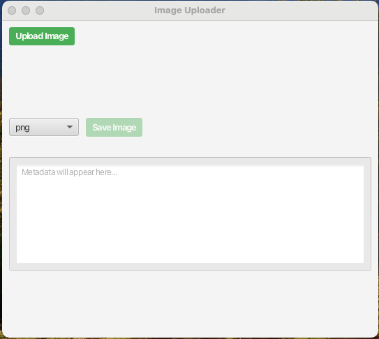
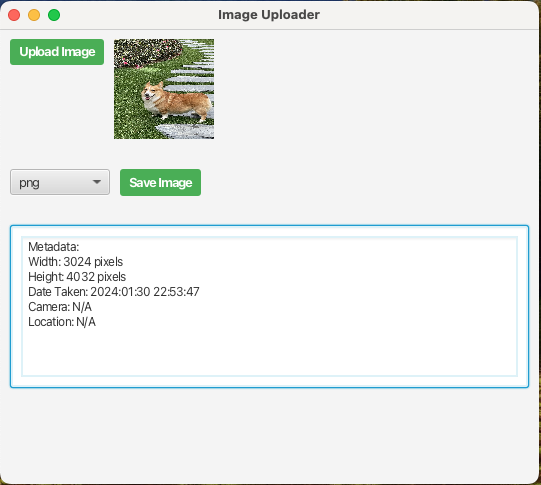
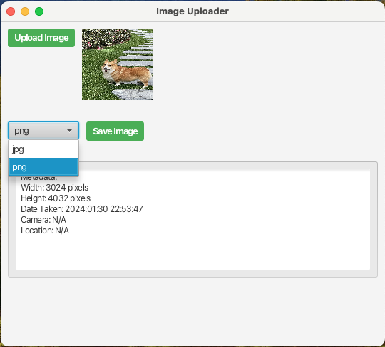
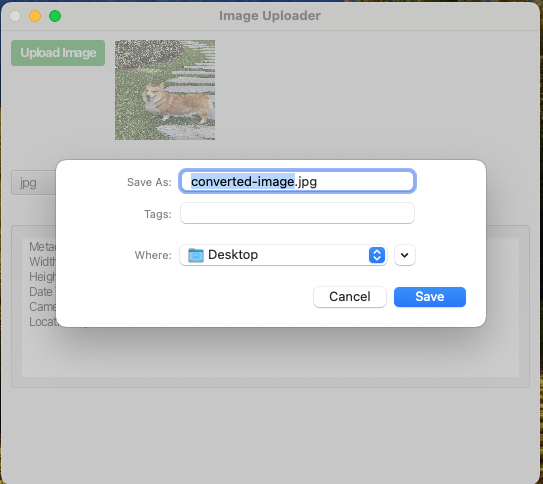

# ImageManager

## Project Overview

The ImageManager is a desktop application built using JavaFX that allows users to upload image files, view their metadata, and convert them between JPG and PNG formats. It provides a simple graphical interface for common image handling tasks.

## Features

* Upload image files (supports various formats readable by ImageIO).

* Display key metadata extracted from the uploaded image (e.g., dimensions, date taken, camera info, location).

* Convert the uploaded image to either JPG or PNG format.

* Save the converted image to a specified location on desktop.

## Technical Stack

* **GUI Framework:** JavaFX

* **Language:** Java

* **Image Handling:** Java Image I/O (javax.imageio)

* **Libraries:** `metadata-extractor 2.19.0` (for reading metadata) and `xmpcore 6.1.0` (dependency for metadata reading) by Drew Noakes.

## Design & Implementation

This project demonstrates several key object-oriented programming principles and the factory design pattern:

* **Inheritance:** The `app.Main` class extends `javafx.application.Application`, inheriting the core framework for a JavaFX application.

* **Encapsulation:** Classes like `app.controller.ImageController` encapsulate their internal state (e.g., UI component references, `currentFile`) using `private` access modifiers. Access and modification are controlled through public methods and event handlers. Utility classes like `converter.ConverterFactory` and `model.metadata.MetadataReader` use private constructors to prevent instantiation.

* **Interfaces:** The `converter.ImageConverter` interface defines a contract for image conversion. Concrete classes like `converter.JPGConverter` and `converter.PNGConverter` implement this interface, providing specific conversion logic while allowing the `app.controller.ImageController` to interact with them polymorphically.

* **Design Pattern:** The **Factory Pattern** is implemented in the `converter.ConverterFactory` class. It provides a static method (`getConverter`) to create instances of `ImageConverter` implementations (`JPGConverter` or `PNGConverter`) based on a given format string, decoupling the client code (`ImageController`) from the concrete converter classes.

* **Exception Handling:** Basic exception handling is implemented using `try-catch` blocks in image processing and metadata reading sections to prevent the application from crashing on errors.

* **Code Comments:** The source code includes Javadoc and inline comments to explain the purpose of classes, methods, parameters, and complex logic, adhering to industry standards.

## Class Diagram

The following diagram illustrates the main classes, interfaces, and their relationships within the project:
```
+-----------------+
|      Main       |
+-----------------+
| + start(Stage)  |
| + main(String[])|
+-----------------+
         ^
         | extends
+-----------------+
|   Application   |
+-----------------+


+-----------------------+
|    ImageController    |
+-----------------------+
| - root : VBox         |
| - metadataTextArea: TextArea |
| - formatSelector: ComboBox |
| - saveButton : Button |
| - currentFile : File  |
+-----------------------+
| + createScene(Stage): Scene |
+-----------------------+
         |
         | uses
         v
+-----------------+
|      Main       |
+-----------------+


+-----------------+               +-----------------+
| MetadataReader  |               | ConverterFactory|
+-----------------+               +-----------------+
| + {static} readMetadata(File): String | + {static} getConverter(String): ImageConverter |
+-----------------+               +-----------------+
         ^                               ^
         | uses                          | uses
         |                               |
+-----------------------+               +-----------------------+
|    ImageController    |               |    ImageController    |
+-----------------------+               +-----------------------+


+-----------------------+
|    ImageConverter     |
|     <<interface>>     |
+-----------------------+
| + convert(File, File): void |
+-----------------------+
         ^                       ^
         | implements            | implements
         |                       |
+-----------------+             +-----------------+
|  JPGConverter   |             |  PNGConverter   |
+-----------------+             +-----------------+
| + convert(File, File): void | | + convert(File, File): void |
+-----------------+             +-----------------+


 Note: Dependencies on File, ImageIO, BufferedImage,
       ImageMetadataReaderLib, MetadataLib are implied by method
       signatures and usage within classes like
       JPGConverter, PNGConverter, and MetadataReader,
       but are not explicitly drawn with lines in this ASCII format
       to keep the diagram simpler, similar to the example image.
```
## Installation
### Technical Prerequisites
- Java JDK 21 installed
- JavaFX SDK 24 downloaded and set up
- metadata-extractor and xmpcore jars placed under `lib/`
### Instructions to Run
1.  **Clone the repository:**
    ```bash
    git clone [https://github.com/linyige0514/INFO5100_002068977_LinyiGe]
    ```
2.  **Open the project in your IDE:**
    ```
    Open your preferred Java Integrated Development Environment (IDE) such as IntelliJ IDEA, Eclipse, or VS Code. Use the IDE's "Open Project" or "Import Project" function and select the root directory of the cloned repository.
    ```
3.  **Build the project:**
    ```bash
    javac --module-path /path/to/javafx-sdk/lib --add-modules javafx.controls -cp "lib/*" -d out src/app/Main.java src/app/controller/*.java src/converter/*.java src/model/metadata/*.java src/util/*.java
    cp -r resources out/
    ```
4.  **Run the `app.Main` class:**
    ```bash
    java --module-path /path/to/javafx-sdk/lib --add-modules javafx.controls -cp "out:lib/*" app.Main
    ```
## GUI Samples
### Here are some screenshots demonstrating the application's interface and functionality during testing:

1. A view of the application's main window upon startup.



2. Shows an image loaded into the application with its extracted metadata displayed.



3. Illustrates the dropdown for selecting the output image format.



4. Demonstrates the file dialog that appears when saving the converted image.



